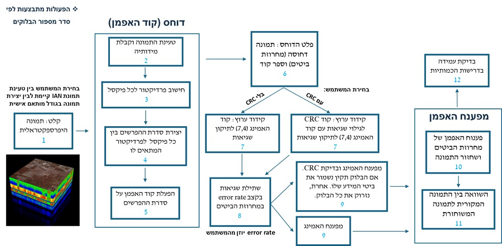

[](https://www.python.org/downloads/release/python-380/)
[](https://opensource.org/licenses/MIT)
[](#)


# **Combined Source/Channel Coding for Hyperspectral Sensing**

This project is an advanced implementation of **combined source/channel coding** for compressing and error-correcting hyperspectral images. It leverages **Huffman encoding**, **Hamming (7,4)** error correction, and **CRC validation** to achieve high performance in data compression and error correction.
<p align="center">

</p>


---

### **Table of Contents**
1. [Overview](#project-overview)
2. [Features](#key-features)
3. [Setup](#setup)
4. [Usage](#usage)
5. [Results](#results-and-evaluation)
6. [Citing This Work](#citation)

---

## **Project Overview**
This project implements a **combined source/channel coding system** for compressing and error-correcting hyperspectral images. The system incorporates **Huffman encoding**, **Hamming (7,4) error correction codes**, and **Cyclic Redundancy Check (CRC)** for validation. A GUI application is included to allow users to load or create images, select parameters, and visualize results.

### **Key Features**:
- Hyperspectral image compression using Huffman coding.
- Error correction via Hamming (7,4) codes.
- Data validation using CRC.
- Supports custom or preloaded hyperspectral images.
- Graphical User Interface (GUI) for user interaction.
- Quantitative evaluation of compression ratio, Bit Error Rate (BER), and computational complexity.

---

### **Setup**

Clone the repository and install dependencies:
```bash
git clone https://github.com/your-repo/project-name.git
cd project-name
pip install -r requirements.txt
```

Launch the application:
```bash
python main.py
```

---

## **Usage**
1. **GUI Interface:**
   - Run `main.py` to launch the GUI.
   - Use the interface to:
     - Load or create an image.
     - Select error rate and CRC settings.
     - Process and analyze results.

2. **Key GUI Components:**
   - **Input Image:**
     - Load `IAN` hyperspectral image.
     - Create a custom image with specified dimensions.
   - **CRC Settings:**
     - Toggle CRC usage (`YES`/`NO`).
   - **Error Rate:**
     - Set the error injection rate (e.g., 1 bit error per `N` bits).

3. **Run Process:**
   - Click **Run Process** to start encoding, decoding, and analysis.
   - View results in the log window.

---

## **Results and Evaluation**
#### Compression Ratio and BER
- **Compression Ratio:** Achieves better than 1:4 in most cases.
- **Bit Error Rate:** Maintains BER below \(10^{-5}\).

#### Visualization:
Original, compressed, and reconstructed images are displayed for analysis.

| Original Image | Compressed Differences | Reconstructed Image |
|----------------|-------------------------|----------------------|
|  |  |  |

---

## **File Structure**
```plaintext
/project-name
|-- main.py                # Main application file
|-- README.md              # Project documentation
|-- requirements.txt       # Dependencies list
|-- /images                # Example images and outputs
|-- /src                   # Source code for compression and error correction
    |-- crc.py             # CRC encoding and validation
    |-- hamming.py         # Hamming (7,4) encoding/decoding
    |-- huffman.py         # Huffman encoding/decoding
    |-- gui.py             # GUI components
```

---

## **Key Functions**
### Compression and Encoding:
- **`crc_encode(data)`**: Encodes data with a 3-bit CRC.
- **`hamming_encode_vectorized(bitstring)`**: Encodes data with Hamming (7,4).
- **`huffman_encode_bitstring(flat_differences, huffman_tree)`**: Compresses data using Huffman coding.

### Error Correction and Validation:
- **`crc_check(data)`**: Validates data integrity using CRC.
- **`hamming_decode_7bit(received_block)`**: Corrects single-bit errors in Hamming blocks.

### BER Calculation:
- **`Calculate_Ber_NO_CRC(original, received)`**: Computes BER before correction.
- **`Calculate_Ber_After_CRC(original, received, valid_indices)`**: Computes BER after CRC validation.

---

## **Citation**
If you find this project helpful, please consider citing:

```bibtex
@article{your_citation,
  title={Combined Source/Channel Coding for Hyperspectral Sensing},
  author={Your Name, Collaborator Names},
  journal={Journal Name},
  year={2025},
  publisher={Your Institution}
}
```

---

## **Acknowledgments**
Special thanks to the developers of the [Huffman library](https://github.com/username/huffman) and [Spectral Python](http://www.spectralpython.net/).

---

