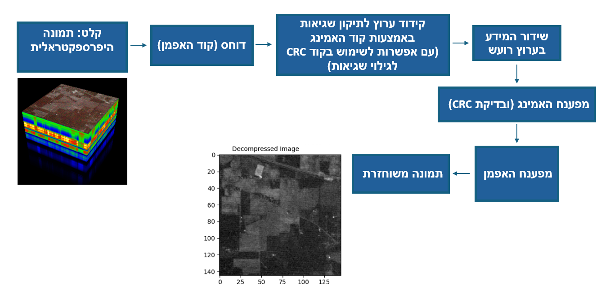
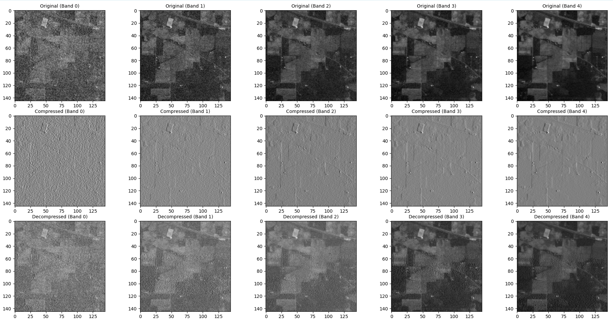
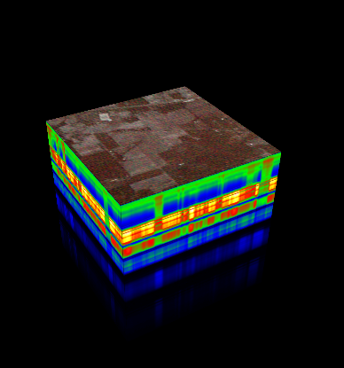

[](https://www.python.org/downloads/release/python-380/)
[](https://opensource.org/licenses/MIT)
[](#)

# **קידוד משולב מקור/ערוץ של חישה היפר-ספקטראלית**


## תקציר

פרויקט זה עוסק בפיתוח אלגוריתם לדחיסת תמונה היפרספקטראלית ולתיקון שגיאות בערוץ לווייני רועש. האלגוריתם מיועד לננו-לוויין המצויד במצלמה היפרספקטראלית, המאפשרת צילום במספר אורכי גל לצורך זיהוי חתימות ספקטראליות של מזהמים באטמוספירה ועל הקרקע.
רוחב הסרט המוגבל וזמן החליפה הקצר מעל תחנת הקרקע מחייבים דחיסת מידע בחלל לפני שידורו לכדור הארץ. מצד שני, דחיסת המידע מגדילה את רגישותו לשגיאות בערוץ ועלולה לגרום לשגיאה קטסטרופלית במהלך הפיענוח. האלגוריתם שלנו מאפשר שליטה בפרמטרים 
שונים של הדוחס ושל הצופן לתיקון שגיאות בהתאם לחשיבות המידע הנדחס, על מנת להגיע לאופטימיזציה של קריטריון ביצועים משולב של דחיסה מצד אחד ועמידות לשגיאות מצד שני בתנאי הסתברות שגיאה שונים בערוץ הלווייני בו משודר המידע מהלוויין לכדוה"א. 
ביצועי האלגוריתם נבחנו על גבי בסיס נתונים של לווייני חישה מרחוק. 
<p align="center">

</p>


## מטרות הפרויקט

מטרת הפרויקט היא פיתוח אלגוריתם לקידוד משולב מקור/ערוץ של חישה היפרספקטראלית. 
האלגוריתם נועד לבצע דחיסת תמונה היפרספקטראלית בשילוב קודים לתיקון שגיאות, במטרה לעמוד בדרישות הכמותיות שהוגדרו על ידי מנחה הפרויקט. 
הדרישות מבוססות על נתוני לווין היפרספקטראלי כפי שמתואר בספרות, וביצועי האלגוריתם נבחנו והודגמו על בסיס נתונים של לווייני חישה מרחוק. 

**הדרישות הכמותיות**:
   - יחס דחיסה: **1:4** או טוב יותר.
   - יחס שגיאות לביט (BER): **<10^(-5)** לאחר תיקון.
   - זמן עיבוד ממוצע לפיקסל: **216 ננו-שניות** או פחות.  
   - רזולוציה: האלגוריתם נדרש לבצע דחיסה של תמונה היפרספקטראלית בגודל **145X145X220 פיקסלים ב- 5 אורכי גל שונים**.


## תהליך העבודה

### שלב 1: טעינת תמונה
- **טעינת תמונה היפרספקטרלית**:
  - שימוש בפונקציה `spectral.open_image` לטעינת תמונה בפורמט IAN.
  - תצוגת התמונה מתבצעת באמצעות `spectral.view_cube` להצגת מבנה תלת-ממדי של התמונה.
- **יצירת תמונה מותאמת אישית**:
  - יצירת תמונה עם גרדיאנטים מרחביים ושונות ספקטרלית.
  - הוספת רעש אקראי לערוצי התמונה והתאמת ערכים לטווח מתאים (0-17736).

### שלב 2: חישוב פרדיקטור
  - מחשבים את הפרדיקטור עבור כל פיקסל על סמך הערך של הפיקסל הימני שלו בציר ה-X. עבור הפיקסלים בקצה הימני של כל שורה, נעשה שימוש בפיקסל השמאלי.
  - שימוש בפונקציה `np.roll` להזזת מטריצות.
 

### שלב 3: דחיסת נתונים עם קוד האפמן
- **חישוב התפלגות ערכים**: שימוש ב-`Counter` לחישוב תדירות ההפרשים.
- **בניית עץ האפמן**: מימוש עץ הקידוד בעזרת `huffman.codebook`.
- **קידוד**: הפעלת קידוד האפמן בעזרת הפונקציה `huffman_encode_bitstring`.

### שלב 4: קידוד ותיקון שגיאות
- **קידוד עם CRC**: הוספת 3 ביטי CRC לכל בלוק של 13 ביטים בעזרת `crc_encode`.
- **קידוד האמינג**: קידוד בלוקי נתונים בגודל 4 ביטים ל-7 ביטים בעזרת `hamming_encode_vectorized`.
- **קידוד משולב**: שילוב CRC והאמינג בקוד משולב באמצעות `crc_hamming_encode`.

### שלב 5: הזרקת שגיאות
- שימוש בפונקציה `introduce_errors` להזרקת שגיאות אקראיות בנתונים המקודדים בהתאם לשיעור השגיאות שנבחר.

### שלב 6: פענוח ושחזור
- **פענוח האמינג**: תיקון שגיאות בבלוקים של 7 ביטים בעזרת `hamming_decode_7bit`.
- **בדיקת CRC**: בדיקת תקינות בלוקים ופילטר שגיאות באמצעות `crc_check`.
- **פענוח משולב**: פענוח בלוקים עם CRC והאמינג בעזרת `crc_hamming_decode_and_validate`.
- **שחזור נתונים**:
  - פענוח האפמן בעזרת `huffman_decode_bitstring`.
  - שחזור התמונה המקורית על בסיס הפרדיקטור וההפרשים.

### שלב 7: ניתוח תוצאות
- **חישוב מדדים כמותיים**:
  - יחס דחיסה.
  - שיעור שגיאות (BER) לפני ואחרי תיקון.
  - זמן עיבוד ממוצע לפיקסל.
- **בדיקות עמידה בדרישות**:
  - בדיקה אם יחס הדחיסה גדול מ-1:4.
  - בדיקה אם ה-BER לאחר תיקון נמוך מ-10^-5.
  - בדיקה אם זמן העיבוד לפיקסל קטן מ-216 ננו-שניות.

### שלב 8: תצוגת תוצאות חזותית
- הצגת התמונה המקורית, הדחוסה, והמשוחזרת עבור 5 ערוצי ספקטרום בעזרת `matplotlib`.

### שלב 9: פיתוח ממשק משתמש גרפי (GUI)
- **בחירה בתמונה**: טעינת תמונת IAN קיימת או יצירת תמונה מותאמת אישית עם ממדים מותאמים אישית.
- **בחירת הגדרות CRC**: הפעלה או ביטול של CRC בקידוד הנתונים.
- **הגדרת שיעור שגיאות**: הזנת שיעור השגיאות להזרקה בנתונים.
- **הרצת התהליך**: כפתור "Run Process" להפעלת כל שלבי הקוד והצגת תוצאות חזותיות וכמותיות.
- **תצוגת לוג**: הדפסת נתונים ומדדים על מסך הממשק להצגת שלבי התהליך.


## תרשים הזרימה של התהליך

<p align="center">

</p>


## תוצאה חזותית לדוגמה

התמונה מציגה שלוש רמות עיבוד על פני חמישה אורכי גל (Bands):

- **מקורית (Original)**: הערוצים המקוריים מתוך התמונה ההיפרספקטרלית.
- **דחוסה (Compressed)**: הפרשים בין הערכים בתמונה המקורית לבין הפרדיקטור, שעברו דחיסה באמצעות קוד האפמן.
- **משוחזרת (Decompressed)**: התמונה ששוחזרה לאחר דחיסת האפמן, שתילת שגיאות, פענוח האמינג (ו-CRC בהתאם לבחירת המשתמש) ופענוח האפמן לפרישת התמונה.


<p align="center">

</p>


## יצירת סביבה ב-Python

כדי להתחיל לעבוד עם הפרויקט, יש ליצור סביבה מותאמת של Python הכוללת את כל הספריות הנדרשות. הנה ההנחיות:


### **התקנת Python**
<div dir="rtl"> 
- הורד והתקן את גרסת Python המתאימה (3.8 או גרסה גבוהה יותר) מהאתר הרשמי [Python.org]: (https://www.python.org/downloads/release/python-380/) 
 

   
- בדוק שההתקנה בוצעה בהצלחה על ידי הפעלת הפקודה הבאה בטרמינל:
  
  ```bash

  python --version


 
1. התקן את הספריות המופיעות בקובץ: [requirements](requirements.txt)  

   ```bash

   pip install -r requirements.txt

2. הורד לתיקייה בה שמור הקוד את התמונה 92AV3C.lan (תמונה זו לקוחה מאתר דוקומנטציה של פייתון):
<div dir="rtl">  
https://www.spectralpython.net/user_guide_intro.html
<p align="center">

</p>


## שימוש והוראות הפעלה

### ממשק משתמש (GUI)

1. הרץ את `FinalProject_29.12.2024_WithGui_Version5.py` כדי לפתוח את הממשק.
2. השתמש בממשק כדי:
   - **לטעון או ליצור תמונה מותאמת אישית.**
   - **לבחור הגדרות CRC ושיעור שגיאות.**
   - **לעבד ולנתח תוצאות.**

### רכיבי מפתח בממשק:

- **תמונה קלט**:
  - טעינת תמונת IAN או יצירת תמונה מותאמת אישית (יש להזין את מימדי התמונה בתצורה: x,y,z).
- **הגדרות CRC**:
  - בחר האם להפעיל CRC על ידי בחירת הפרמטר (YES/NO).
- **שיעור שגיאות**:
  - קביעת שיעור הזרקת השגיאות (למשל ביט שגוי לכל N ביטים).
- **כפתור Run Process**:
  - מתחיל את תהליך העיבוד המלא, הכולל שלבים של קידוד, הזרקת שגיאות, פענוח, וניתוח תוצאות.
- **כפתור Clear**:
  - מנקה את חלון הלוג, מאפס את הפרמטרים, ומאפשר התחלה מחדש של התהליך בממשק.


## רישיון
הפרויקט מופץ תחת רישיון CC BY-NC-SA 4.0. למידע נוסף ראה [LICENSE](./LICENSE).
