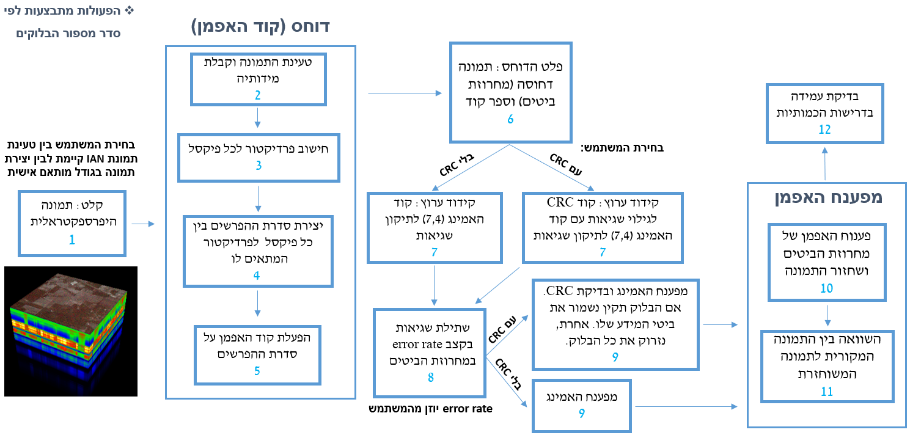

[](https://www.python.org/downloads/release/python-380/)
[](https://opensource.org/licenses/MIT)
[](#)

# **קידוד משולב מקור/ערוץ של חישה היפר-ספקטרלית**

---

## תקציר

פרויקט זה עוסק בפיתוח אלגוריתם לדחיסת תמונה היפרספקטרלית ולתיקון שגיאות בערוץ לווייני רועש.האלגוריתם מיועד לננו-לוויין המצויד במצלמה היפרספקטרלית, המאפשרת צילום במספר אורכי גל לצורך זיהוי חתימות ספקטרליות של מזהמים באטמוספירה ועל הקרקע.
רוחב הסרט המוגבל וזמן החליפה הקצר מעל תחנת הקרקע מחייבים דחיסת מידע בחלל לפני שידורו לכדור הארץ. מצד שני, דחיסת המידע מגדילה את רגישותו לשגיאות בערוץ ועלולה לגרום לשגיאה קטסטרופלית במהלך הפיענוח. האלגוריתם שלנו מאפשר שליטה בפרמטרים 
שונים של הדוחס ושל הצופן לתיקון שגיאות בהתאם לחשיבות המידע הנדחס, על מנת להגיע לאופטימיזציה של קריטריון ביצועים משולב של דחיסה מצד אחד ועמידות לשגיאות מצד שני בתנאי הסתברות שגיאה שונים בערוץ הלווייני בו משודר המידע מהלוויין לכדוה"א. 
ביצועי האלגוריתם נבחנו על גבי בסיס נתונים של לווייני חישה מרחוק. 
<p align="center">

</p>

---

## מטרות הפרויקט

1. **דחיסת מידע אמינה**: פיתוח אלגוריתם דחיסה חסרת עיוות, המאפשר שחזור מלא של המידע המקורי.  
2. **תיקון שגיאות בערוץ רועש**: שילוב קוד האמינג (7,4) ובדיקת CRC לתיקון שגיאות בהתאם לדרישות.  
3. **עמידה בדרישות כמותיות**:
   - יחס דחיסה: **1:4** או טוב יותר.
   - יחס שגיאות לביט (BER): **<10^(-5)** לאחר תיקון.
   - זמן עיבוד ממוצע לפיקסל: **216 ננו-שניות** או פחות.  
4. **ממשק משתמש גרפי (GUI)**: פיתוח כלי המאפשר הרצה נוחה עם פרמטרים מותאמים.

---

## תהליך העבודה

### שלב 1: דחיסת מידע
- חישוב **פרדיקטור** לכל פיקסל בהתבסס על פיקסלים שכנים.
- הפעלת **קוד האפמן** על סדרת ההפרשים בין כל פיקסל לפרדיקטור המתאים.  
- מימוש דחיסה חסרת עיוות (Lossless) המאפשרת שחזור מלא.

### שלב 2: תיקון שגיאות
- כתיבת אלגוריתם לתיקון שגיאות באמצעות **קוד האמינג (7,4)**.
- שילוב **CRC Validation** כאופציה לתיקון שגיאות במצבים מורכבים.

### שלב 3: בדיקות ביצועים
- **בדיקות כמותיות**:
  - יחס דחיסה.
  - שיעור שגיאות (BER) לאחר תיקון.
  - זמן עיבוד לפיקסל.
- שימוש בבסיס נתונים של לווייני חישה מרחוק להערכת האלגוריתם.

### שלב 4: פיתוח ממשק משתמש
- פיתוח **GUI** עם אפשרות לבחירת פרמטרים כגון:
  - גודל התמונה.
  - שיעור שגיאות (BER).
  - שימוש אופציונלי בקוד CRC.
- כלי זה מאפשר הרצה יעילה בתרחישים מגוונים.

---

## תרשים הזרימה של התהליך

<p align="center">

</p>

---

## תוצאה חזותית לדוגמה

<p align="center">

</p>

---

## שימוש והוראות הפעלה

### ממשק משתמש (GUI)

1. הרץ את `main.py` כדי לפתוח את הממשק.
2. השתמש בממשק כדי:
   - **לטעון או ליצור תמונה מותאמת אישית.**
   - **לבחור הגדרות CRC ושיעור שגיאות.**
   - **לעבד ולנתח תוצאות.**

### רכיבי מפתח בממשק:
- **תמונה קלט**:
  - טעינת תמונת IAN או יצירת תמונה מותאמת אישית.
- **הגדרות CRC**:
  - הפעלת CRC (כן/לא).
- **שיעור שגיאות**:
  - קביעת שיעור הזרקת שגיאות (למשל ביט שגוי לכל N ביטים).

---

## איך להריץ את הפרויקט?

1. התקן את התלויות:  
   ```bash
   pip install -r requirements.txt
